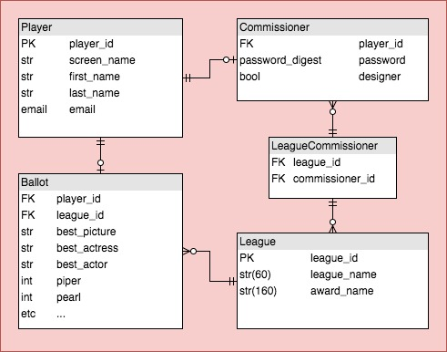
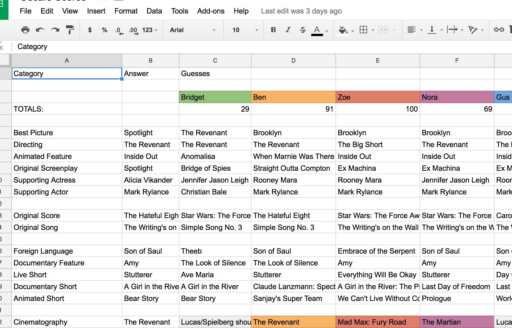
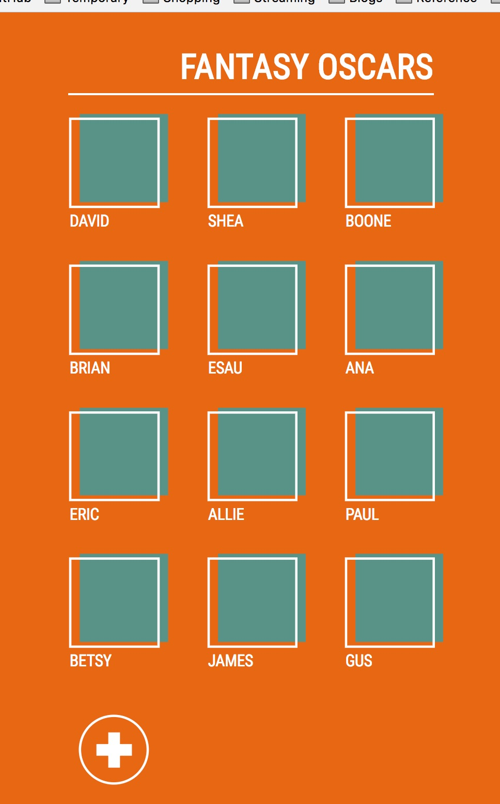
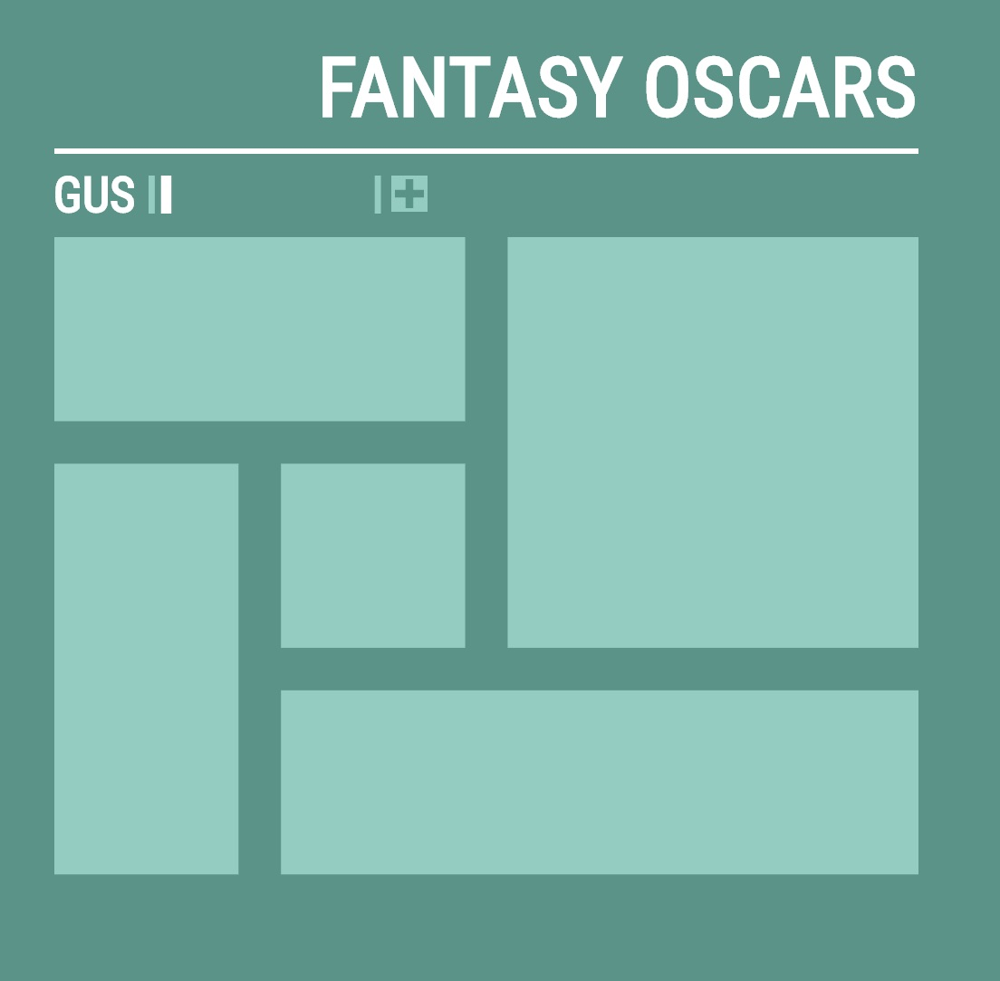
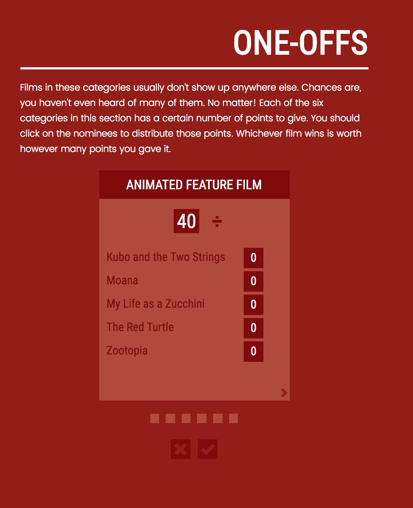
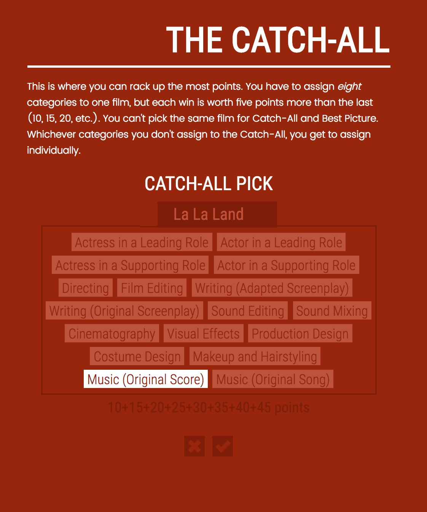
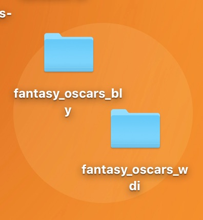
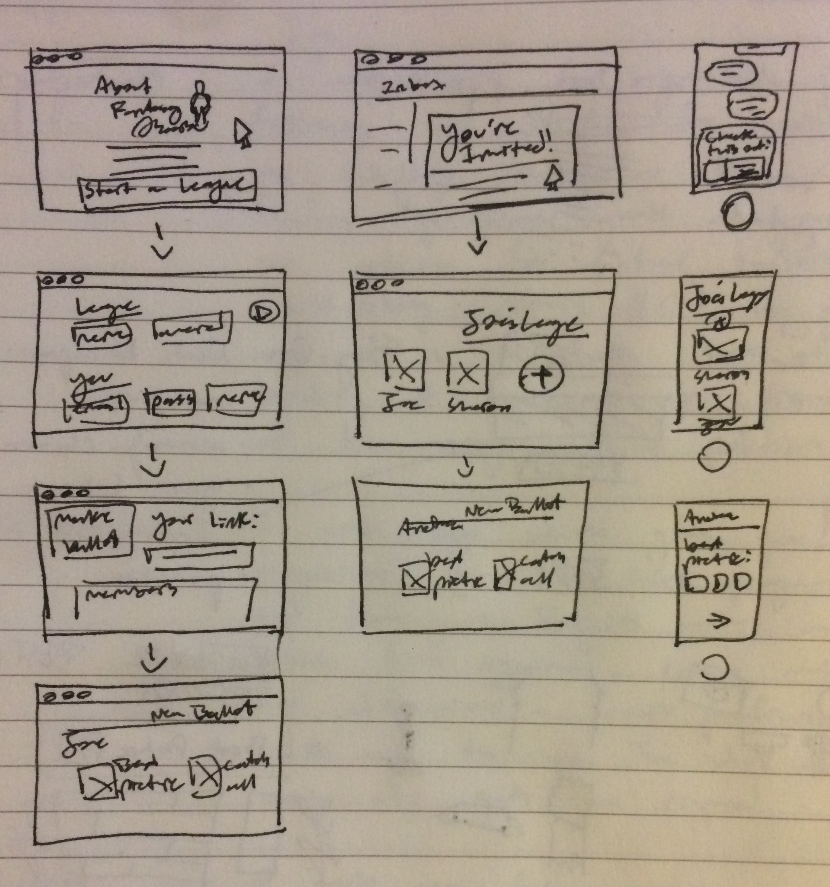

#Fantasy Oscars
>In this brief note directly under the title, I would like to acknowledge the relative frivolity of this project. Since it's a frivolity I'll be engaged with regardless of my excuse, I'm going to commit myself to making this Rails implementation as robust and delightful as possible. At the very least, it'll bring down the net time I devote, annually, to making a fantasy sports game out of the Oscars...

## Peer Review

Hello, valued peer-reviewer. Presently, my project is just a few steps past MVP, so excuse its drab appearance. 

There are three different kinds of users in the app: players (not authenticated), commissioners (authenticated, but lacking some administrative power), and designers (authenticated, all-powerful). 

You don't need to go through the app as every user type, but I do recommend you create a commissioner account and visit `/designer-dashboard`, as there's some important functionality there you can't get to in other ways. For demo purposes, all new commissioners are automatically designers. 

Here's a link to my Trello Board:

[Trello](https://trello.com/b/imfbPujC/fantasy-oscars)

And a copy of my ERD:

## Process

**Fantasy Oscars**

The idea of the Oscars as a fantasy sports game comes from one of my favorite podcasts, [Battleship Pretension](http://battleshippretension.com/category/episode/). Although their version is much more complicated and more closely resembles actual fantasy football or whatever, I've had some success just making a slightly ballot-based game with complicated scoring rules.

I try to make the game a little bit better every year. The games I strive to emulate and measure up to are *Seven Wonders* and *Civ V* - these games are all about making decisions, cleaving to one "area" of the game's mechanics or another (science, economics, etc.) and hoping it pays off. I first took a step into Rails territory with a simple app with scaffolded resources, which looked like this:

This actually worked really well for what I needed: a database-backed app that would allow me to collect ballots from anyone I wanted. Since I knew everyone who put a name on a ballot, troubleshooting was simplified a good deal. One thing that was not simple: managing two separate "leagues". I wanted index for my family, another for my web development class, which meant deploying two copies of the same app:

Obviously, that won't scale. This app is meant to be an answer to that. I can use the same JavaScript mediation when I'm collecting ballots, but bring them into a much more robust back-end - which can support any number of leagues and any number of ballots.

**My Minimum Viable Product:**
* Has *commissioners*, who sign up for authenticated accounts and may interact with the CRUD operations of the *ballots* model. 
* Has *players*, who may join a league via a unique url. Players must provide an email address and may create one *ballot* each.
* Has a *commissioner interface*, which allows the *commissioner* to visually interact with their *ballots*
* Can collect and evaluate valid *ballots* according to the rules the developer sets for the game. 

**Areas of Interest**
* Minimizing the role of passwords in an environment where the stakes are low.
* Creating a robust and reusable framework for a game designer.
* Cultural punditry through the Oscars game - the game as self-expression.
* Replicating standard social dynamics in software.

## Technologies Used

This project uses the **Rails 5** framework with **BCrypt** for authentication. Beyond those included in the framework and the one mentioned before, no other gems were used. 

## Installation Instructions

This project was built in Rails. Running it locally is a simple matter of cloning this repository to your machine, opening up the root in a command-line-interface, running `bundle install`, then `rails s` to start the server.

## Still to Do

(a.k.a. Unsolved Problems)

I'll be doing a lot of work on the application between now and next year's Oscars, as the app in its current state isn't quite enough to show to people.

* Write a script which allows for easy dumpage of the ballots model after the Oscars. Emails, leagues, and commissioners should be preserved, but every other field of the ballot should go, and the related views and javascript should be archived.
* Make private league link as soon as a league is created - use unique screen names and league names in the routing, not ids. The link can be compiled from the given name and the league id. 

* Implement a "time travel" feature for designers where they can go back through old ballot to harvest code and inspiration...
* Add a LeagueBallot model so that one ballot can exist in many leagues.
* Make collecting emails from players optional. If the commissioner checks the "Turn off email" switch, email validation is turned off for new players. This could be something the commissioner deals with when setting up her league.
